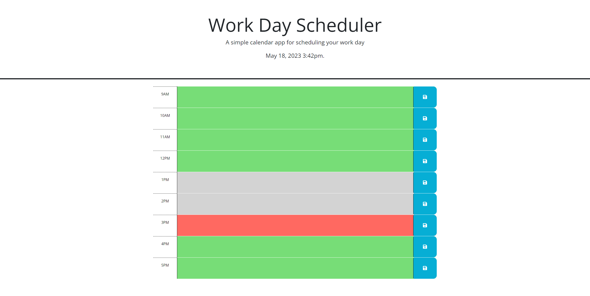

# work-day-schedule

## Description 

    A simple calendar application that allows the user to save events based on the hour that he/she selected based on the common working hours of 9am-5pm. The time will be automatically rendered on the top of the screen for convenience. This application is ran in the browser and will utilize local storage to save text inputs for the calendar. Features HTML and CSS powered by jQuery. 

## Badges

NA

## Visuals

## Installation

NA 
## Usage

Calender is an interactive event lister in which the user will enter an event based on the hour selected. The page will automatically adjust which hour is currently in the past (grey), present (red), or future (green) based on the user's current time. 

## Roadmap

Add a method to clear all values stored in local storage. 

## Contributing

Not currently open to contributions at this time.

## Authors and acknowledgement

Justin Dong
## License

NA

## Resources

[Github Repository](https://github.com/dong135790/quiz-code-test)
[Deployed Site](https://dong135790.github.io/quiz-code-test/)

## Project Status

~~~~